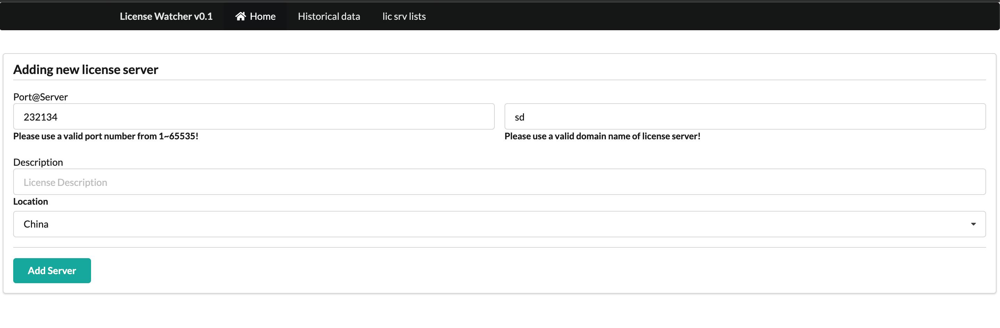
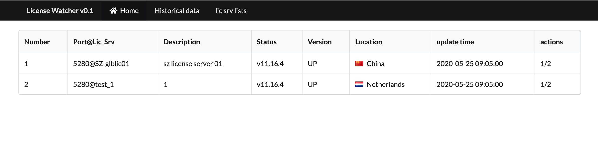
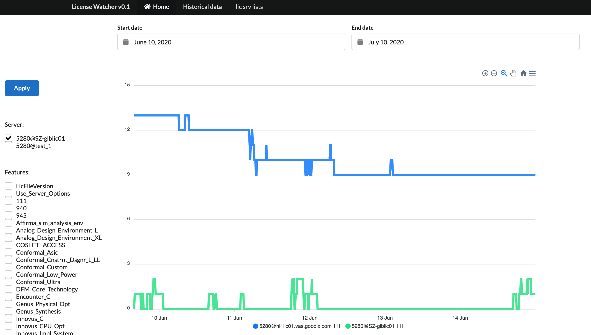

# License

This program is licensed under the term of MIT License. You can find a file LICENSE.md in this direcotry with a plain text copy of it.

# What this program does

+ shows the health status of license server
+ Check the current usage of each license and who is currently using it.
+ Provide the history usage chart of license usage, which can be used to define the usage trend.

# 这个程序能做什么

+ 展示许可服务器的健康状态
+ 查看每个license 当前的使用量和谁在正在使用它
+ 提供历史数据的图表，可以用来判断使用趋势

# Requirements

+ development is python 3.6.6, theoretically supports version 3.6.6 and above
+ other python packages can be checked in requirements.txt
+ sqlite3 needed (default installed in most Linux distribution)


# 使用需求

+ 开发环境为python 3.6.6，理论上支持3.6.6 及以。
+ 其他python packages 可以在requirements.txt 中查看
+ 需求sqlite3 （大多数Linux 发行版中默认安装）

# Install Process

1. Clone repostiory locally using git.

```bash
git clone https://github.com/Rapit-D/lic_watcher.git
```
2. enable venv environment, and install python packages.
```bash
python3 -m venv lic_watcher
cd lic_watcher
source bin/activate
pip install -r requiments.txt
```

3. Create the database.

```bash
sqlite3
sqlite> .read create.sql
```

4. Setup cron to run scheduled job to collect remote license server info.

```bash
crotab -e
*/10 * * * * /usr/bin/python3 /var/www/html/lic_watcher/info_gather.py
```
5. setup apache or nginx server

# 安装步骤

1. 使用git 在本地克隆代码仓库

```bash
git clone https://github.com/Rapit-D/lic_watcher.git
```
2. 启用虚拟python venv 虚拟环境，并安装所需packages.
```bash
python3 -m venv lic_watcher
cd lic_watcher
source bin/activate
pip install -r requiments.txt
```

3. 创建数据库.

```bash
sqlite3
sqlite> .read create.sql
```

4. 配置定时任务，采集远程license 服务器数据.

```bash
crotab -e
*/10 * * * * /usr/bin/python3 /var/www/html/functions/info_gether.py
```
5. 配置apache 或nginx 服务器

# Example details/ 样例截图

## 1. Add New Server/ 添加新的license 服务器



## 2. Health Status Display/ 健康状态展示



## 3. History Data Chart/ 历史数据图表

Click right side Servers checkbox can be generate following Features checkbox automatically. You can drag directly on the chart to select a more accurate time period to view the data

选择右侧不同的Server 复选框可根据服务器拥有Feature 自动生成下方复选框。你也可直接在图表上拖动选择更精确的时间段查看数据。



# 4. Current Lic Usage Display/ 当前许可使用展示


