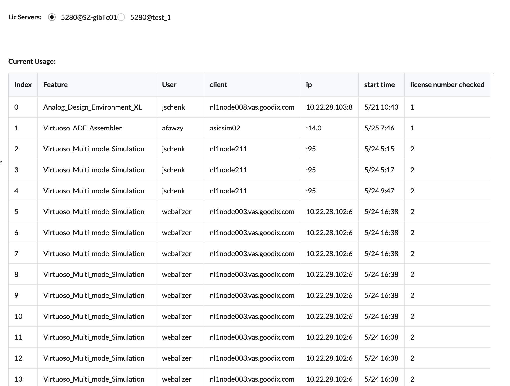

# License

This program is licensed under the term of MIT License. You can find a file LICENSE.md in this direcotry with a plain text copy of it.

# What this program does

+ shows the health status of license server
+ Check the current usage of each license and who is currently using it.
+ Provide the history usage chart of license usage, which can be used to define the usage trend.

# 这个程序能做什么

+ 展示许可服务器的健康状态
+ 查看每个license 当前的使用量和谁在正在使用它
+ 提供历史数据的图表，可以用来判断使用趋势

# Requirements

+ development is python 3.6.6, theoretically supports version 3.6.6 and above
+ other python packages can be checked in requirements.txt
+ sqlite3 needed (default installed in most Linux distribution)


# 使用需求

+ 开发环境为python 3.6.6，理论上支持3.6.6 及以。
+ 其他python packages 可以在requirements.txt 中查看
+ 需求sqlite3 （大多数Linux 发行版中默认安装）

# Install Process

1. Clone repostiory locally using git.

```bash
git clone https://github.com/Rapit-D/lic_watcher.git
```
2. enable venv environment, and install python packages.
```bash
python3 -m venv lic_watcher
cd lic_watcher
source bin/activate
pip install -r requiments.txt
```

3. Create the database.

```bash
sqlite3
sqlite> .read create.sql
```

4. Setup cron to run scheduled job to collect remote license server info.

```bash
crotab -e
*/10 * * * * /usr/bin/python3 /var/www/html/lic_watcher/info_gather.py
```
5. setup apache or nginx server

# 安装步骤

1. 使用git 在本地克隆代码仓库

```bash
git clone https://github.com/Rapit-D/lic_watcher.git
```
2. 启用虚拟python venv 虚拟环境，并安装所需packages.
```bash
python3 -m venv lic_watcher
cd lic_watcher
source bin/activate
pip install -r requiments.txt
```

3. 创建数据库.

```bash
sqlite3
sqlite> .read create.sql
```

4. 配置定时任务，采集远程license 服务器数据.

```bash
crotab -e
*/10 * * * * /usr/bin/python3 /var/www/html/functions/info_gether.py
```
5. 配置apache 或nginx 服务器

# Docker Deployment
1. Install latest docker on your server.
2. Create two volumes to store sqlite database and license server infomation.

```bash
# Create two docker volume
docker volume create sqlite_db
docker volume create srv_info
```
3. Check the mountpoint of sqlite_db, and create database inside it.
```bash
# check the mountpoint of sqlite_db
docker volume inspect sqlite_db

# create database file under sqlite_db
touch $MOUNTPINT/lic.db

# open created database file
sqlite3 $MOUNTPOINT/lic.db

# create tables needed
CREATE TABLE lic_usage(
id integer PRIMARY KEY autoincrement,
server varchar(100),
feature varchar(100),
current_date DATE,
current_time TIME,
current_users integer,
total_lic_available integer
);
```
4. 同上检查docker Volume srv_info 的MOUNTPOINT 创建所需文件
```bash
# check the mountpoint of srv_info
docker volume inspect srv_info

# create a json file under it to store license servers infomation
touch $MOUNTPOINT/home_page.json

# open created json file and add "[]" inside
vim $MOUNTPOINT/home_page.json
[]

```
5. Pull Image
```bash
docker pull rayding62/lic_watcher:version1.2
```

6. Run Docker

```bash
docker run -p 80:5000 --name flask -v sqlite_db:/app/db/ \
-v srv_info:/app/static/server_info/ \
rayding62:lic_watcher:version1.2 \
sh -c "python app.py"
```


# Docker 部署

1. 安装新版docker 到服务器
2. 创建两个volume 分别用来存储sqlite 数据库和需要监控的服务器信息

```bash
# 创建两个docker volume
docker volume create sqlite_db
docker volume create srv_info
```
3. 检查创建的sqlite_db volume 在服务器中的存储为之，查看其中的Mountpoint 值
```bash
# 检查sqlite_db 在服务器中的存储目录
docker volume inspect sqlite_db

# 在该Volume 的目录下创建数据库文件
touch $MOUNTPINT/lic.db

# 打开数据库文件
sqlite3 $MOUNTPOINT/lic.db

# 创建应用所需表
CREATE TABLE lic_usage(
id integer PRIMARY KEY autoincrement,
server varchar(100),
feature varchar(100),
current_date DATE,
current_time TIME,
current_users integer,
total_lic_available integer
);
```
4. 同上检查docker Volume srv_info 的MOUNTPOINT 创建所需文件
```bash
# 检查srv_info 在服务器中的存储目录
docker volume inspect srv_info

# 在该Volume 下创建服务器存储信息的json 文件
touch $MOUNTPOINT/home_page.json

# 打开home_page.json 添加"[]"并保存
vim $MOUNTPOINT/home_page.json
[]

```
5. 下载image
```bash
docker pull rayding62/lic_watcher:version1.2
```

6. 开始运行容器

```bash
docker run -p 80:5000 --name flask -v sqlite_db:/app/db/ \
-v srv_info:/app/static/server_info/ \
rayding62:lic_watcher:version1.2 \
sh -c "python app.py"
```


# Example details/ 样例截图

## 1. Add New Server/ 添加新的license 服务器


## 2. Health Status Display/ 健康状态展示


## 3. History Data Chart/ 历史数据图表

Click right side Servers checkbox can be generate following Features checkbox automatically. You can drag directly on the chart to select a more accurate time period to view the data

选择右侧不同的Server 复选框可根据服务器拥有Feature 自动生成下方复选框。你也可直接在图表上拖动选择更精确的时间段查看数据。


## 4. Current Lic Usage Display/ 当前许可使用展示


